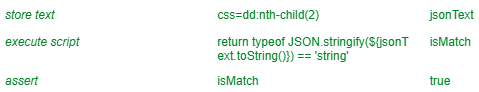

# Learning Selenium IDE

Just one of the things I'm learning. <https://github.com/hchiam/learning>

Chrome extension: <https://chrome.google.com/webstore/detail/selenium-ide/mooikfkahbdckldjjndioackbalphokd>

API for the chrome extension: <https://www.selenium.dev/selenium-ide/docs/en/api/commands>

## My own explorations of using Selenium IDE

- <https://github.com/hchiam/selenium-travis>
- <https://github.com/hchiam/learning-azure-devops-selenium-webdriver>
- <https://github.com/hchiam/autologinbot>
- <https://github.com/hchiam/learning-azure-devops>
- <https://github.com/hchiam?tab=repositories&q=selenium>

## Random notes

- <https://stackoverflow.com/questions/50593047/how-do-i-find-match-a-string-in-selenium-ide>
- `execute script`, `return 'value'`, `varName`
  - you can use execute script to set a variable with a value, which other steps can use
- you can: `open`, `https://www/.../${varName}/subpath/`
  - you can use a variable in the middle of a URL path to more dynamically navigate to URLs
- `assert element present`, `xpath=//pre[contains(text(),varName)]`
  - you can use such a variable in xpath `contains`, NOTE: you cannot use regex in xpaths/selectors in Selenium IDE
  - you can get around this limitation by using `assert element present` and then use `contains` to check each non-changing part ("before", "after", "middle")
- `echo`, `${varName}`
  - echo works like console.log
- `assert`, `varName`, `true`
  - you can even use `assert` to assert a variable value directly
- `execute script`, `if (${labelText}.match(/someRegex/)) { return true; } else { return false };`, `isMatch`
  - or, for example: 
  

## Also see Katalon Recorder

<https://github.com/hchiam/learning-katalon>
